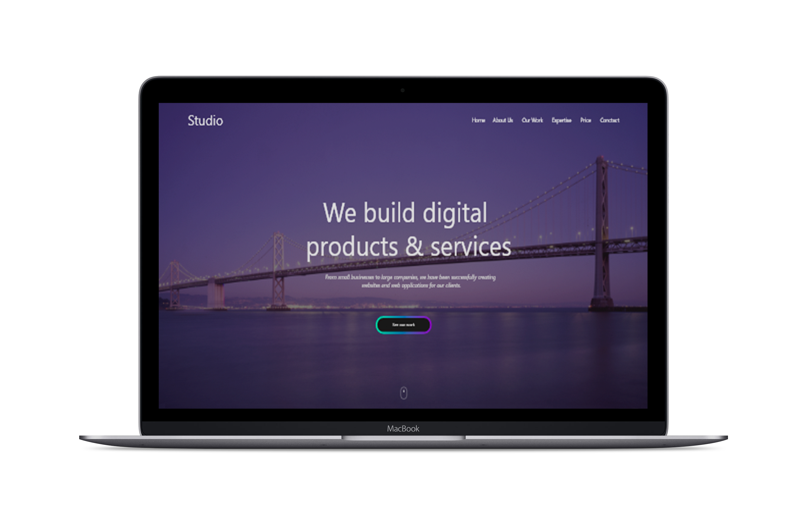

# Studio
My new project made on a free layout. 
I used methodology BEM, simple parallax and slink - jquery plagin for slider. Site is crossbrowser and adaptive.
If you not it is difficult the please write your assessment of and opinion, point to the that need correct :)

  [Site](https://triplicates.github.io/Studio/)

